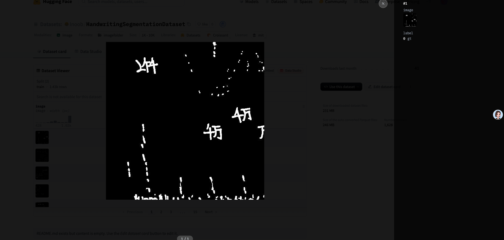
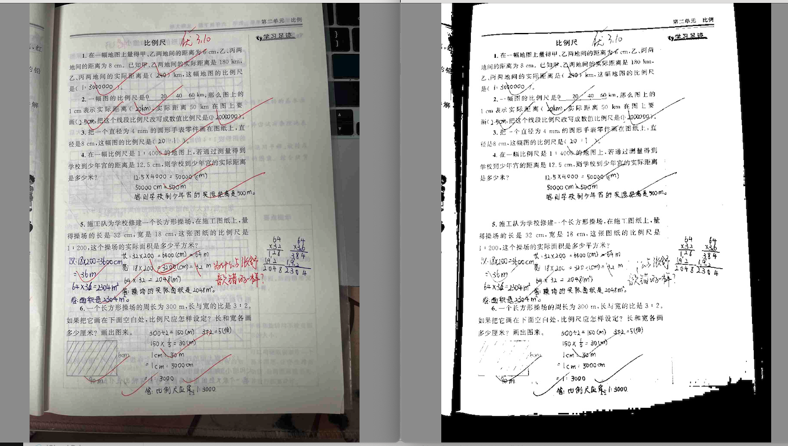

# 安装
## 环境 
```

python3.10 -m venv venv
source venv/bin/activate

pip install -r requirements.txt 

```

## 模型
```
# 下载 https://huggingface.co/Inoob/DIS-Handwriting-Remover/tree/main/isnet.pth 到本地

scp -r  -P 10067 ./isnet.pth fxbox@frp.fxait.com:/data/work/DISHRemove/ 
```

## 训练数据集
https://huggingface.co/datasets/Inoob/HandwritingSegmentationDataset


## 运行后拷贝
scp -r  -P 10067  fxbox@frp.fxait.com:/data/work/DISHRemove/images/result/  /Users/linzhiji/Downloads


# 说明
原项目  https://huggingface.co/Inoob/DIS-Handwriting-Remover

## 效果
效果不行！！！！



